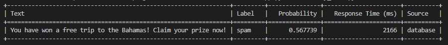

# BERT-based-Text-Classification-REST-API


## Introduction

This project is a FastAPI-based RESTful API for text classification using a fine-tuned BERT model and Cassandra database integration. It enables users to classify text as spam or ham (non-spam) . We chose Cassandra for its linear scalability, making it suitable for handling large volumes of data with high availability and fault tolerance.

## How It Works

The application operates as follows:

1. **Database Check**:
   - Upon receiving a request, the application first checks if the text exists in the database.
   - If the text is found, the application directly returns the stored result (label and probability) associated with the text in the database.
   - If the text is not found, the application proceeds to the next step.

2. **Model Prediction**:
   - If the text is not found in the database, the application tokenizes the text and submits it to the BERT model to predict whether it is spam or not.
   - Prediction is performed using the specified pre-trained BERT model in the code.
   - The prediction result (label and probability) is returned.

3. **Database Storage**:
   - After prediction, the application stores the text, predicted label, probability, username, and timestamp in the database for future use.
   - This improves performance by avoiding re-predicting texts already classified.

4. **Client Response**:
   - Once prediction is completed, the application returns the results (label, probability, response time, source) to the client as an HTTP response.

This enables efficient text classification by leveraging both the data stored in the database and the predictive capabilities of the BERT model.


## Features

- **BERT Model Integration**: Utilizes a fine-tuned BERT (Bidirectional Encoder Representations from Transformers) model for text classification, achieving high accuracy and performance.
- **Cassandra Database**: Integrates with Cassandra for storing and retrieving text data efficiently, with the ability to scale horizontally as data volume increases.
- **FastAPI Endpoint**: Provides a RESTful API endpoint for text classification, enabling easy integration with various applications and systems.
- **Classification**: Allows users to classify text in real-time, ensuring timely responses to requests.

## Usage

1. **Start the Services**: Run `docker-compose up` to start the Cassandra database and the FastAPI application.

2. **Classify Text**: Send a POST request to `http://localhost:8000/classify/` with the text to classify and the username. For example:

    ```bash
    curl -X 'POST' \
      'http://localhost:8000/classify/' \
      -H 'Content-Type: application/json' \
      -d '{
      "text": "You have won a free trip to the Bahamas! Claim your prize now!",
      "username": "your_username"
    }'
    ```
    or you can simply run classify_text.py .
3. **Retrieve Classification Result**: The API will return the classification result, including the label (spam/ham), probability, response time, and source.

## Screenshots




### Note

We can notice that the response time of retrieving from the database is much less than the one of predicting from the model. This is due to the fact that querying the database involves simple data retrieval operations, whereas predicting from the model requires tokenization, inference, and softmax calculations, which are more computationally intensive tasks.

## Future work

**Developing a User-Friendly Interface**: Enhance the application by creating an intuitive and user-friendly interface for better usability and accessibility.

**Improving Model Performance**: Investigate methods to enhance the performance and accuracy of the spam classification model, potentially by fine-tuning hyperparameters or incorporating more sophisticated algorithms.

**Enhancing Security Measures**: Implement robust security measures to protect sensitive user data and ensure compliance with privacy regulations

## Tools 

**FastAPI**: Python web framework used for building the REST API. <br>
**Cassandra**: Distributed NoSQL database chosen for its linear scalability and fault tolerance. <br>
**PyTorch**: Deep learning framework used for building and deploying the BERT-based spam classification model. <br>
**Transformers**: Library for natural language processing tasks, used for tokenization and model loading. <br>
**Docker**: Containerization platform used to package the application and its dependencies.


